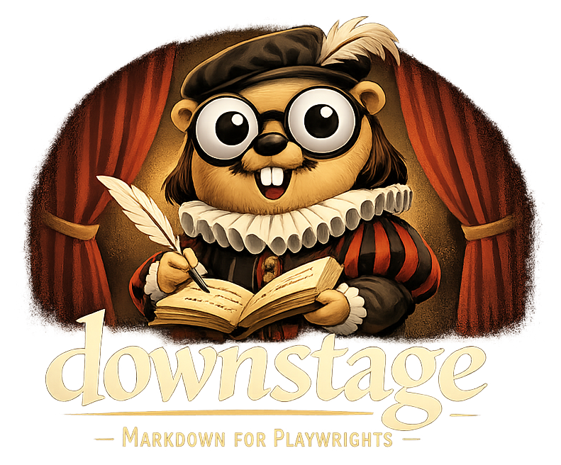

<p align="center">
  
</p>

# Downstage

[](https://www.getdownstage.com/)
[](https://www.getdownstage.com/editor/)

A plain-text playwriting format with a simple way to write, preview, and
export PDF manuscripts.

## What is Downstage?

Downstage is a plaintext markup language for writing stage plays, inspired by
[Fountain](https://fountain.io/) (for screenplays) and the archived
[TheatreScript](https://github.com/contrapunctus-1/TheatreScript) spec. It
gives you three clear ways to start: the Web Editor, the VS Code
extension, or the command line. Files use the `.ds` extension.

If you just want to start, open the [Web Editor](https://www.getdownstage.com/editor/).

Read the [Syntax Guide](https://www.getdownstage.com/).

## Website

The Pages site is built with [Eleventy](https://www.11ty.dev/) from the
templates in `site/`.

```bash
npm install
npm --prefix web install
npm run build:site
npm run serve:site
```

## Quick Example

```
# The Example Play
Author: Jane Smith
Date: 2025
Draft: First

## Dramatis Personae

HAMLET - Prince of Denmark
HORATIO - Friend to Hamlet

### Courtiers

ROSENCRANTZ - A courtier
GUILDENSTERN - A courtier

## ACT I

### SCENE 1

> The battlements of Elsinore Castle. Night.

HORATIO
Who's there?

HAMLET
(aside)
A piece of work is man, how **noble** in reason,
how *infinite* in faculty.
  In form and moving, how express
  and admirable; in action, how like
  an angel.

HORATIO
They're here.

HAMLET ^
Then let them come.

// A line comment

> Enter GHOST

===

### SCENE 2

ROSENCRANTZ
Good my lord!

SONG 1: The Wanderer's Lament

HAMLET
  O, that this too, too solid flesh
  Would melt, thaw, and resolve itself
  Into a dew.

SONG END
```

## Features

- Readable plaintext format — scripts look natural without markup noise
- Inline formatting: `*italic*`, `**bold**`, `***bold italic***`, `_underline_`, `~strikethrough~`
- Verse support via indentation (2+ spaces)
- Dual dialogue with trailing `^` on the second cue
- Songs with `SONG`/`SONG END` blocks
- Comments: `// line` and `/* block */`
- Forced elements: `@character` and `.heading` for edge cases
- Character aliases: `HAMLET/HAM` or `[HAMLET/HAM]`
- Page breaks: `===`
- LSP server with:
  - Semantic syntax highlighting
  - Document outline (acts/scenes/characters)
  - Hover info on character names (shows description from dramatis personae)
  - Go-to-definition (jump to character's dramatis personae entry)
  - Context-aware completion for character cues
  - Diagnostics (parse errors, unknown character warnings, Dramatis
    Personae hygiene, cue hygiene)
  - Code actions (quick fixes for unknown characters, unnumbered or
    misnumbered acts/scenes, duplicate DP entries, and inserting a
    missing Dramatis Personae section)
- Neovim integration out of the box (0.11+)
- CLI tools for parsing and validation

## Installation

If you are new to Downstage, you probably want the Web Editor or the VS
Code extension before you want installation steps.

```
go install github.com/jscaltreto/downstage@latest
```

### Homebrew

```
brew tap jscaltreto/tap
brew install downstage
```

## CLI Usage

```
downstage parse play.ds       # Output AST as JSON
downstage validate play.ds    # Check for errors
downstage render play.ds      # Render to PDF (default)
downstage render -f html play.ds  # Render to HTML
downstage lsp                 # Start LSP server (stdio)
downstage version             # Print version info
```

Use `-v` or `--verbose` to enable debug logging on any command.

`downstage validate` exits non-zero on parse errors. `downstage parse` prints
parse errors to stderr but still emits the AST JSON. `downstage render` exits
non-zero if parsing fails.

### Render Formats and Styles

`downstage render` supports PDF (default) and HTML output via `--format`:

```
downstage render play.ds                              # PDF, manuscript
downstage render --format html play.ds                # HTML, manuscript
downstage render --format html --style condensed play.ds
downstage render --format html -o play.html play.ds   # explicit output file
```

Both formats support two styles via `--style`:

- **`standard`** (default, Manuscript) — Traditional manuscript format. Character names
  centered above dialogue, generous margins.
- **`condensed`** (Acting Edition) — Acting edition format designed for rehearsal use. Character
  names inline with dialogue (e.g. `HAMLET. To be or not...`), tighter spacing.

PDF uses Courier 12pt on letter-size pages for manuscript, and Libre Baskerville
10pt on half-letter for acting edition. HTML produces a self-contained document with
embedded CSS using semantic `.downstage-*` class names for custom styling.

## Editor Setup

### Neovim (0.11+)

Install [downstage.nvim](https://github.com/jscaltreto/downstage.nvim) with
your plugin manager:

```lua
-- lazy.nvim
{ "jscaltreto/downstage.nvim", ft = "downstage" }
```

This provides filetype detection, buffer settings, and LSP integration for `.ds`
files. The `downstage` binary must be on your `PATH`.

If you use `nvim-cmp`, enable the plugin's optional completion integration to
limit Downstage buffers to LSP-driven cue completions:

```lua
-- lazy.nvim
{
  "jscaltreto/downstage.nvim",
  ft = "downstage",
  opts = {
    cmp = true,
  },
}
```

### Other Editors

Any LSP-compatible editor can use the Downstage language server. The server
communicates over stdio using JSON-RPC 2.0 (LSP 3.17). Point your editor's LSP
client at the server:

```json
{
  "command": ["downstage", "lsp"],
  "filetypes": ["downstage"],
  "rootPatterns": [".git"]
}
```

### VS Code

The [`editors/vscode/`](editors/vscode/) extension provides full Downstage
support: LSP-powered completions, diagnostics, and folding; live PDF preview;
render-to-PDF commands; snippets; and TextMate syntax highlighting.

See the [extension README](editors/vscode/README.md) for details.

For local development:

```bash
cd editors/vscode
npm install
npm run compile
```

Then open the `editors/vscode` folder in VS Code and press `F5` to launch an
Extension Development Host.

### Web Editor

[**Start writing**](https://www.getdownstage.com/editor/) in the Web Editor, a
modern browser-based editor built with Vue 3, Tailwind CSS v4, and CodeMirror 6.
It features live preview, adaptive syntax highlighting, completions and
quick-fix code actions sourced from the Downstage LSP, spellcheck with a
per-script dictionary, and PDF export. No install required; the entire
pipeline runs client-side via WebAssembly.

For local development:

```bash
npm --prefix web install
make web      # Build the editor for Pages output
make web-dev  # Run the editor dev server with Vite
```

See [`web/README.md`](web/README.md) for details.

## Language Overview

A Downstage document is organized around top-level `#` sections:

1. **Play Header** — each play starts with `# Title`, followed by optional `Key: Value` metadata lines such as `Author:` or `Draft:`
2. **Dramatis Personae** — an optional `## Dramatis Personae`, `## Cast of Characters`, or `## Characters` section inside that play, with character entries and optional `###` subgroup headings; rendered output keeps the chosen wording
3. **Body** — the play itself: acts (`## ACT`), scenes (`### SCENE`), dialogue (ALL CAPS character name followed by speech text), stage directions (`>` prefixed lines), callouts (`>>` prefixed lines), verse (indented 2+ spaces), songs, and comments

### Dual Dialogue

To mark simultaneous dialogue, put `^` at the end of the second character cue.

```text
HORATIO
They're here.

HAMLET ^
Then let them come.
```

The renderer places the two dialogue blocks side by side when they fit on the page.
If they do not fit cleanly, rendering falls back to sequential dialogue instead of
producing broken columns.

See [SPEC.md](SPEC.md) for the complete language specification.

## Building from Source

```
git clone https://github.com/jscaltreto/downstage.git
cd downstage
make
```

To embed version information:

```
go build -ldflags "\
  -X github.com/jscaltreto/downstage/cmd.version=1.0.0 \
  -X github.com/jscaltreto/downstage/cmd.commit=$(git rev-parse HEAD) \
  -X github.com/jscaltreto/downstage/cmd.date=$(date -u +%Y-%m-%dT%H:%M:%SZ)" \
  -o downstage .
```

## Releases

Release PRs and changelog updates are managed by Release Please. Merging a
release PR creates the Git tag and GitHub release, and GoReleaser then builds
artifacts for macOS, Linux, and Windows on `amd64` and `arm64`.

For local release validation:

```
make release-check
make release-snapshot
```

These targets require [`goreleaser`](https://goreleaser.com/install/) to be
installed locally.

Publishing the Homebrew formula is handled by the release workflow, which
updates `jscaltreto/homebrew-tap` after GoReleaser publishes release assets.
This requires a repository secret named `HOMEBREW_TAP_GITHUB_TOKEN` with push
access to `jscaltreto/homebrew-tap`.

Release Please requires a repository secret named `RELEASE_PLEASE_TOKEN` with
enough access to create release PRs, tags, and releases in
`jscaltreto/downstage`.

## License

Downstage source code is licensed under the [MIT License](LICENSE).

Bundled fonts in [`internal/render/pdf/fonts/`](/home/jake/git/theatrescript/internal/render/pdf/fonts/)
remain under the SIL Open Font License 1.1; see the included `OFL.txt` and
`OFL-LibreBaskerville.txt` files.

## Acknowledgments

- [Fountain](https://fountain.io/) — screenplay markup language that inspired Downstage's plaintext philosophy
- [TheatreScript](https://github.com/contrapunctus-1/TheatreScript) — archived stage play markup spec that Downstage builds on
