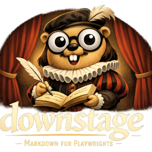

# Downstage for VS Code

Downstage is a VS Code extension for writing stage plays in
[Downstage](https://www.getdownstage.com/docs/) markup. It provides full
LSP support, live PDF preview, render commands, snippets, diagnostics, and
TextMate syntax highlighting.

## Quick Start

1. Install this extension from the Visual Studio Marketplace or Open VSX.
2. On supported release builds, the extension uses its bundled `downstage`
   binary automatically.
3. If you want to override that binary or you are on an unsupported platform,
   set `downstage.server.path` or install
   [`downstage`](https://github.com/jscaltreto/downstage) on your `PATH`.
4. Open a `.ds` file and start writing.

## Features

### Language Server

The extension communicates with the Downstage language server (`downstage lsp`)
to provide:

- Context-aware character cue completions
- Structural heading completions
- Diagnostics surfaced in the Problems panel
- Folding for title pages, sections, songs, and block comments

### Live Preview

Open a real-time PDF preview inside VS Code that updates as you type.
The debounce delay is configurable.

### PDF Rendering

Render the current script to a standard or compact PDF directly from the
command palette. The generated file opens automatically (configurable).

### Snippets

Pre-built snippets for common Downstage constructs let you scaffold a play
skeleton, add acts, scenes, cues, stage directions, and songs with a few
keystrokes.

### Syntax Highlighting

A TextMate grammar provides highlighting for all Downstage constructs:
metadata, headings, stage directions, songs, parentheticals, character cues,
aliases, verse, and comments.

## Commands

| Command | Description |
| --- | --- |
| Downstage: Restart Language Server | Restart the LSP connection |
| Downstage: Render Current Script | Render to standard PDF |
| Downstage: Render Condensed Script | Render to condensed PDF |
| Downstage: Preview Current Script PDF | Preview standard PDF in VS Code |
| Downstage: Preview Condensed Script PDF | Preview condensed PDF in VS Code |
| Downstage: Live Preview | Live-updating PDF preview |

## Snippets

| Prefix | Description |
| --- | --- |
| `play` | Full play skeleton with title page, cast, act, and scene |
| `act` | Act heading |
| `scene` | Scene heading |
| `cue` | Character cue with dialogue |
| `stage` | Stage direction |
| `song` | Song block |

## Settings

| Setting | Type | Default | Description |
| --- | --- | --- | --- |
| `downstage.server.path` | string | `""` | Optional explicit path to the `downstage` executable. When empty, the extension prefers the bundled binary and then falls back to `PATH` |
| `downstage.server.trace` | string | `"off"` | LSP trace verbosity (`off` / `messages` / `verbose`) |
| `downstage.editor.autoSuggestCharacterCues` | boolean | `true` | Auto-trigger cue suggestions on empty lines |
| `downstage.render.style` | string | `"standard"` | Render style (`standard` / `condensed`) |
| `downstage.render.openAfterRender` | boolean | `true` | Open PDF after rendering |
| `downstage.preview.debounceMs` | number | `300` | Delay before re-rendering live preview (ms) |

## Requirements

Marketplace release builds bundle the `downstage` binary for:

- `linux-x64`
- `darwin-x64`
- `darwin-arm64`
- `win32-x64`

If you need a different binary, set `downstage.server.path`. If no bundled
binary is present, the extension falls back to `downstage` on your `PATH`.

Release notes for the extension come from the repository root
[`CHANGELOG.md`](../../CHANGELOG.md).

## Release Process

The VS Code extension ships from this repository. It does not maintain a
separate release track.

- Release tags `v*` drive the extension version used for packaged VSIX files.
- `.github/workflows/release.yml` packages one VSIX per supported platform and
  uploads them to the GitHub release.
- If the `VSCE_PAT` GitHub Actions secret is configured, the same workflow also
  publishes those VSIX files to the Visual Studio Marketplace.
- If the `OVSX_TOKEN` GitHub Actions secret is configured, the workflow also
  publishes the same VSIX files to Open VSX.
- The registries are published independently, so one can fail without blocking
  the other.

## Related

- [Downstage documentation](https://www.getdownstage.com/docs/)
- [GitHub repository](https://github.com/jscaltreto/downstage)

## Development

```bash
cd editors/vscode
npm install
npm run compile
npm run package
```

Press `F5` in VS Code to launch an Extension Development Host.
